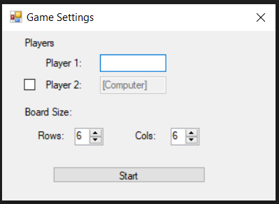
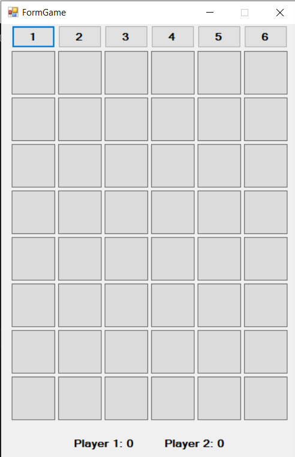
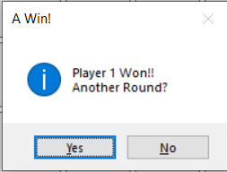

# 🎮 4 in a Row – Windows Forms (C#)

A desktop implementation of the classic **4 in a Row** game, built with  
C# and Windows Forms, focusing on clean OOP design, dynamic UI generation, and event-driven architecture.

---

## 🚀 Project Highlights

### 🔹 Dynamic UI Generation
- The game board is generated dynamically based on user-defined rows and columns.
- Column buttons are created programmatically.
- The window resizes according to the selected board dimensions.

### 🔹 Event-Driven Architecture
- UI reacts to user actions through WinForms events.
- Optional logical-layer events (bonus requirement) notify the UI when board state changes.
- Column buttons automatically disable when a column becomes full.

### 🔹 Separation of Concerns (Logic vs UI)
- Game logic is separated from UI components.
- Board state management is handled independently from presentation.
- UI layer listens and reacts to logical state changes.

### 🔹 State Management
- Tracks:
  - Current player
  - Board matrix
  - Score for each player
  - Win / Tie detection
- Supports multiple rounds with automatic board reset.

### 🔹 Clean OOP Design
- Structured class hierarchy
- Encapsulated board logic
- Clear responsibility separation
- Maintainable and extensible architecture

---

## 🖥️ Application Flow

### 1️⃣ Game Settings Window

- Player 1 name input
- Optional Player 2 (or Computer mode)
- Dynamic board size configuration
- Start button launches the game

### Game Settings Example

---

### 2️⃣ Game Board (Dynamic)

- Column selection buttons
- Dynamically created board grid
- Score tracking labels
- Responsive UI behavior

---

### 3️⃣ Win Detection & Round Handling

- MessageBox displayed on win or tie
- "Yes" → Reset board and continue
- "No" → Exit application

---

## 🛠 Technologies

- C#
- .NET Framework
- Windows Forms
- Object-Oriented Programming
- Event Handling

---

## 📚 Academic Context

Developed as part of an Object-Oriented Programming course in C# and .NET.

---

## 💡 Future Improvements

- Smarter AI opponent
- Animations for coin drops
- Sound effects
- Refactoring to MVVM-like structure
- Unit testing for game logic

---

### 👩‍💻 Author
Lotem Kimchi
